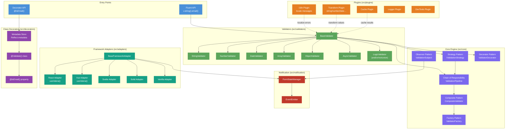
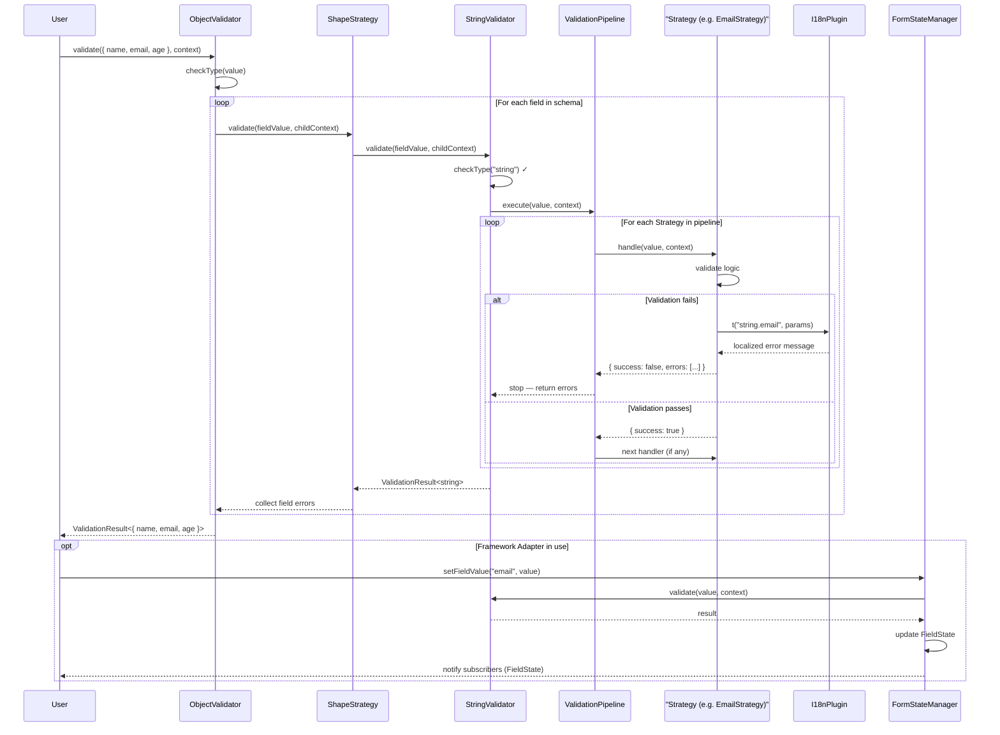
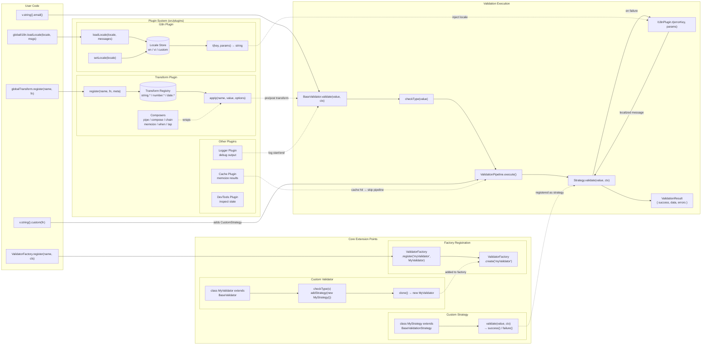

# Valora

**Production-grade TypeScript-first validation framework with class-validator style decorators**

🔗 **GitHub**: [https://github.com/TQTuyen/Valora](https://github.com/TQTuyen/Valora)
📦 **npm**: [https://www.npmjs.com/package/@tqtos/valora](https://www.npmjs.com/package/@tqtos/valora)

A modern, tree-shakeable validation framework for JavaScript/TypeScript with dual APIs: elegant class decorators and chainable fluent validators.

---

## ✨ Features

- 🎨 **Class-Validator Style Decorators** — Familiar, elegant validation syntax with 63+ decorators
- 🔗 **Fluent Chainable API** — `v.string().email().minLength(5)` for schema-based validation
- 🌳 **Tree-Shakeable** — Import only what you need, zero unused code
- 🏗️ **SOLID Architecture** — Built with 6 GoF design patterns for maintainability
- 🌍 **i18n Support** — English & Vietnamese built-in, easily extensible
- 🔒 **Type-Safe** — Full TypeScript inference with `Infer<T>`
- 🎯 **Framework Agnostic** — Core works everywhere
- 🎨 **Framework Adapters** — React, Vue, Svelte, Solid, Vanilla JS
- ⚡ **Production-Ready** — Comprehensive test coverage

---

## 📦 Installation

```bash
# Using bun (recommended)
bun add @tqtos/valora

# Using npm
npm install @tqtos/valora

# Using yarn
yarn add @tqtos/valora

# Using pnpm
pnpm add @tqtos/valora
```

---

## 🚀 Quick Start

### Option 1: Decorators (Recommended for Classes)

Perfect for validating class instances, DTOs, and domain models.

```typescript
import { Validate, IsString, IsEmail, MinLength, Min, IsNumber } from '@tqtos/valora/decorators';

@Validate()
class CreateUserDto {
  @IsString()
  @MinLength(2, { message: 'Name must be at least 2 characters' })
  name: string;

  @IsEmail()
  email: string;

  @IsNumber()
  @Min(18)
  age: number;
}

// Auto-validates on construction!
try {
  const user = new CreateUserDto({
    name: 'John Doe',
    email: 'john@example.com',
    age: 25,
  });
  console.log('Valid user:', user);
} catch (error) {
  console.error('Validation error:', error.message);
}
```

### Option 2: Fluent API (Recommended for Schemas)

Perfect for validating data, API requests, and configuration.

```typescript
import { v, Infer } from '@tqtos/valora';

// Define schema
const createUserSchema = v.object({
  name: v.string().minLength(2),
  email: v.string().email(),
  age: v.number().min(18).optional(),
});

// Infer TypeScript type
type CreateUserDto = Infer<typeof createUserSchema>;

// Validate data
const result = createUserSchema.validate({
  name: 'John Doe',
  email: 'john@example.com',
  age: 25,
});

if (result.success) {
  console.log('Valid data:', result.data); // Fully typed!
} else {
  console.error('Validation errors:', result.errors);
}
```

---

## 🏗️ Architecture

### Component Diagram — Framework Structure

Shows how the major subsystems are organized and how they communicate.



---

### Sequence Diagram — Validation Flow

Shows the end-to-end execution path when calling `.validate()` on a schema.



---

### Class Diagram — Framework Design

Shows the key classes, their relationships, and the 6 GoF patterns at play.

```mermaid
classDiagram
  direction TB

  %% ── Interfaces ──────────────────────────────────────────
  class IValidator {
    <<interface>>
    +_type: string
    +validate(value, context?) ValidationResult
    +isValid(value) boolean
  }

  class IValidationStrategy {
    <<interface>>
    +validate(value, context) ValidationResult
    +withMessage(msg) this
  }

  class IValidationHandler {
    <<interface>>
    +setNext(handler) IValidationHandler
    +handle(value, context) ValidationResult
  }

  class IValidationObserver {
    <<interface>>
    +onValidationStart(event) void
    +onValidationEnd(event) void
    +onValidationError(event) void
  }

  class IFrameworkAdapter {
    <<interface>>
    +getFormState() FormState
    +setFieldValue(field, value) void
    +validateField(field) Promise~FieldState~
    +validateAll() Promise~FormState~
    +subscribeToField(field, cb) Unsubscribe
    +subscribeToForm(cb) Unsubscribe
    +resetAll() void
    +destroy() void
  }

  %% ── Strategy Pattern ────────────────────────────────────
  class BaseValidationStrategy {
    <<abstract>>
    #customMessage?: string
    +validate(value, context)* ValidationResult
    +withMessage(msg) this
    #success(data) ValidationResult
    #failure(errors) ValidationResult
  }

  class EmailStrategy {
    +validate(value, context) ValidationResult
  }

  class MinLengthStrategy {
    -min: number
    +validate(value, context) ValidationResult
  }

  class RequiredStrategy {
    +validate(value, context) ValidationResult
  }

  IValidationStrategy <|.. BaseValidationStrategy
  BaseValidationStrategy <|-- EmailStrategy
  BaseValidationStrategy <|-- MinLengthStrategy
  BaseValidationStrategy <|-- RequiredStrategy

  %% ── Chain of Responsibility ─────────────────────────────
  class BaseValidationHandler {
    <<abstract>>
    #next?: IValidationHandler
    +setNext(handler) IValidationHandler
    +handle(value, context)* ValidationResult
  }

  class StrategyHandler {
    -strategy: IValidationStrategy
    +handle(value, context) ValidationResult
  }

  class ValidationPipeline {
    -handlers: IValidationHandler[]
    +addHandler(h) this
    +execute(value, context) ValidationResult
  }

  IValidationHandler <|.. BaseValidationHandler
  BaseValidationHandler <|-- StrategyHandler
  StrategyHandler --> IValidationStrategy : wraps
  ValidationPipeline --> IValidationHandler : chains

  %% ── Validator Hierarchy ─────────────────────────────────
  class BaseValidator {
    <<abstract>>
    #strategies: IValidationStrategy[]
    #isRequired: boolean
    +validate(value, context) ValidationResult
    +isValid(value) boolean
    +required(opts?) this
    +optional() OptionalDecorator
    +nullable() NullableDecorator
    +default(val) DefaultDecorator
    +transform(fn) TransformDecorator
    +custom(fn, msg?) this
    +withMessage(msg) MessageDecorator
    #checkType(value)* ValidationResult
    #addStrategy(s) this
    #clone()* this
  }

  class StringValidator {
    +email(opts?) this
    +url(opts?) this
    +uuid(opts?) this
    +minLength(n, opts?) this
    +maxLength(n, opts?) this
    +matches(re, opts?) this
    +alpha(opts?) this
    +notEmpty(opts?) this
    #checkType(value) ValidationResult
    #clone() StringValidator
  }

  class NumberValidator {
    +min(n, opts?) this
    +max(n, opts?) this
    +range(min, max, opts?) this
    +integer(opts?) this
    +positive(opts?) this
    #checkType(value) ValidationResult
    #clone() NumberValidator
  }

  class ObjectValidator {
    -shape: Record~string, IValidator~
    +extend(schema) ObjectValidator
    +pick(keys) ObjectValidator
    +omit(keys) ObjectValidator
    +partial() ObjectValidator
    +strict() ObjectValidator
    #checkType(value) ValidationResult
    #clone() ObjectValidator
  }

  class AsyncValidator {
    +validateAsync(value, context) Promise~ValidationResult~
    +timeout(ms) this
    +debounce(ms) this
    +retry(n) this
    +cancel() void
  }

  IValidator <|.. BaseValidator
  BaseValidator <|-- StringValidator
  BaseValidator <|-- NumberValidator
  BaseValidator <|-- ObjectValidator
  BaseValidator <|-- AsyncValidator
  BaseValidator --> ValidationPipeline : executes

  %% ── Decorator Pattern ───────────────────────────────────
  class ValidatorDecorator {
    <<abstract>>
    #wrapped: IValidator
    +validate(value, context) ValidationResult
  }

  class OptionalDecorator {
    +validate(value, context) ValidationResult
  }

  class NullableDecorator {
    +validate(value, context) ValidationResult
  }

  class DefaultDecorator {
    -defaultValue: unknown
    +validate(value, context) ValidationResult
  }

  class TransformDecorator {
    -transformFn: Function
    +validate(value, context) ValidationResult
  }

  IValidator <|.. ValidatorDecorator
  ValidatorDecorator <|-- OptionalDecorator
  ValidatorDecorator <|-- NullableDecorator
  ValidatorDecorator <|-- DefaultDecorator
  ValidatorDecorator <|-- TransformDecorator
  ValidatorDecorator --> IValidator : wraps

  %% ── Composite Pattern ───────────────────────────────────
  class CompositeValidator {
    -validators: IValidator[]
    +add(v) this
    +remove(v) this
    +validate(value, context) ValidationResult
  }

  IValidator <|.. CompositeValidator
  CompositeValidator --> IValidator : contains *

  %% ── Factory Pattern ─────────────────────────────────────
  class ValidatorFactory {
    <<singleton>>
    -registry: Map~string, Constructor~
    +register(name, ctor) void
    +create(name) IValidator
    +has(name) boolean
  }

  ValidatorFactory --> IValidator : creates

  %% ── Observer Pattern ────────────────────────────────────
  class ValidationSubject {
    -observers: IValidationObserver[]
    +addObserver(o) void
    +removeObserver(o) void
    +notifyObservers(event) void
  }

  class FormStateManager {
    -fieldStates: Map~string, FieldState~
    -fieldSubscribers: Map~string, Set~Callback~~
    -formSubscribers: Set~Callback~
    -validators: Record~string, IValidator~
    +setFieldValue(field, value) void
    +touchField(field) void
    +validateField(field) Promise~FieldState~
    +validateAll() Promise~FormState~
    +subscribeToField(field, cb) Unsubscribe
    +subscribeToForm(cb) Unsubscribe
    +getFormState() FormState
    +resetAll() void
  }

  IValidationObserver <|.. FormStateManager
  ValidationSubject --> IValidationObserver : notifies

  %% ── Framework Adapters ──────────────────────────────────
  class BaseFrameworkAdapter {
    <<abstract>>
    #manager: FormStateManager
    +getFormState() FormState
    +validateField(field) Promise~FieldState~
    +destroy() void
  }

  IFrameworkAdapter <|.. BaseFrameworkAdapter
  BaseFrameworkAdapter --> FormStateManager : delegates
  BaseFrameworkAdapter <|-- ReactAdapter
  BaseFrameworkAdapter <|-- VueAdapter
  BaseFrameworkAdapter <|-- SvelteAdapter
  BaseFrameworkAdapter <|-- SolidAdapter
```



---

### Plugin Diagram — Plugin & Custom Validator Mechanism

Shows how plugins extend the core and how users register custom validators and transforms.



---

## 📚 Documentation

- **[Getting Started](./docs/getting-started.md)** — Installation, first steps, and basic patterns
- **[Decorators Guide](./docs/decorators-guide.md)** — Complete reference for all 63 decorators
- **[Validators Guide](./docs/validators-guide.md)** — Fluent API reference and schema validation
- **[Nested Validation](./docs/nested-validation.md)** — Working with nested objects and arrays
- **[Advanced Usage](./docs/advanced-usage.md)** — Custom validators, i18n, async validation, and more
- **[Examples](./docs/examples.md)** — Real-world use cases and patterns
- **[API Reference](./docs/api-reference.md)** — Complete API documentation
- **[Migration Guide](./docs/migration-guide.md)** — Upgrading from legacy decorators

---

## 🎯 Available Decorators

### Common (2)

`@IsOptional()` `@IsRequired()`

### String (17)

`@IsString()` `@IsEmail()` `@IsUrl()` `@IsUuid()` `@MinLength()` `@MaxLength()` `@Length()` `@Matches()` `@StartsWith()` `@EndsWith()` `@Contains()` `@IsAlpha()` `@IsAlphanumeric()` `@IsNumeric()` `@IsLowercase()` `@IsUppercase()` `@NotEmpty()`

### Number (10)

`@IsNumber()` `@IsInt()` `@IsFinite()` `@IsSafeInt()` `@Min()` `@Max()` `@Range()` `@IsPositive()` `@IsNegative()` `@IsMultipleOf()`

### Boolean (3)

`@IsBoolean()` `@IsTrue()` `@IsFalse()`

### Date (12)

`@IsDate()` `@MinDate()` `@MaxDate()` `@IsPast()` `@IsFuture()` `@IsToday()` `@IsBefore()` `@IsAfter()` `@IsWeekday()` `@IsWeekend()` `@MinAge()` `@MaxAge()`

### Array (7)

`@IsArray()` `@ArrayMinSize()` `@ArrayMaxSize()` `@ArrayLength()` `@ArrayNotEmpty()` `@ArrayUnique()` `@ArrayContains()`

### Object (2)

`@IsObject()` `@ValidateNested()`

---

## 🔧 Validators

### Built-in Categories

- **String** — `email()`, `url()`, `uuid()`, `minLength()`, `maxLength()`, `matches()`, etc.
- **Number** — `min()`, `max()`, `range()`, `positive()`, `integer()`, `finite()`, etc.
- **Date** — `past()`, `future()`, `minAge()`, `maxAge()`, `weekday()`, `weekend()`, etc.
- **Array** — `of()`, `min()`, `max()`, `unique()`, `contains()`, `every()`, `some()`, etc.
- **Object** — `shape()`, `partial()`, `pick()`, `omit()`, `strict()`, `passthrough()`, etc.
- **Boolean** — `true()`, `false()`, `required()`
- **File** — `maxSize()`, `mimeType()`, `extension()`, `dimensions()`
- **Business** — `creditCard()`, `phone()`, `iban()`, `ssn()`, `slug()`
- **Async** — `async()`, `debounce()`, `timeout()`, `retry()`
- **Logic** — `and()`, `or()`, `not()`, `union()`, `intersection()`, `ifThenElse()`

---

## 🌍 Internationalization

Built-in support for English and Vietnamese, easily extensible:

```typescript
import { globalI18n } from '@tqtos/valora/plugins';

// Switch to Vietnamese
globalI18n.setLocale('vi');

// Add custom locale
globalI18n.loadLocale('fr', {
  string: {
    required: 'Ce champ est obligatoire',
    email: 'Adresse email invalide',
  },
});
```

---

## 🎨 Framework Adapters

### React

```tsx
import { useValora } from '@tqtos/valora/adapters/react';

export function LoginForm() {
  const { validate, errors } = useValora();

  return (
    <form>
      <input placeholder="Email" onBlur={(e) => validate('email', e.target.value)} />
      {errors.email && <span>{errors.email}</span>}
    </form>
  );
}
```

### Vue

```vue
<script setup>
import { useValora } from '@tqtos/valora/adapters/vue';

const { validate, errors } = useValora();
</script>

<template>
  <input placeholder="Email" @blur="validate('email', $event.target.value)" />
  <span v-if="errors.email">{{ errors.email }}</span>
</template>
```

---

## 📁 Project Structure

```
valora/
├── src/
│   ├── core/             # Validation engine & 6 GoF design patterns
│   │   ├── chain/        # Chain of Responsibility (ValidationPipeline)
│   │   ├── composite/    # Composite pattern (CompositeValidator)
│   │   ├── decorator/    # Decorator pattern (optional/nullable/transform)
│   │   ├── factory/      # Factory pattern (ValidatorFactory singleton)
│   │   ├── observer/     # Observer pattern (ValidationSubject)
│   │   └── strategy/     # Strategy pattern (BaseValidationStrategy)
│   ├── validators/       # Fluent validators (string, number, date, etc.)
│   ├── decorators/       # Class-validator style decorators
│   ├── adapters/         # Framework integrations (React, Vue, Svelte, etc.)
│   ├── plugins/          # i18n, logger, cache, transform, devtools
│   ├── schema/           # Schema builder & coercion
│   ├── notification/     # FormStateManager & EventEmitter
│   ├── utils/            # Utility functions
│   └── types/            # TypeScript type definitions
├── tests/                # Test files (unit, integration, e2e)
├── examples/             # Framework-specific examples
├── docs/                 # Comprehensive documentation
└── dist/                 # Build output (generated)
```

---

## 🛠️ Available Scripts

```bash
# Development
bun run dev              # Watch mode build
bun run build            # Production build with type checking
bun run typecheck        # Type check only

# Testing
bun run test             # Run tests in watch mode
bun run test:run         # Run tests once
bun run test:coverage    # Run tests with coverage report
bun run test:ui          # Run tests with UI

# Code Quality
bun run lint             # Lint source code
bun run lint:fix         # Lint and auto-fix issues
bun run format           # Format code with Prettier
bun run format:check     # Check formatting without changes

# Maintenance
bun run clean            # Remove dist/ directory
```

---

## 🔒 Type Safety

Full TypeScript support with:

- Strict mode enabled
- Explicit return types
- Type inference with `Infer<T>`
- Path aliases support (`@/`, `@validators/`, etc.)

```typescript
import { v, Infer } from '@tqtos/valora';

const userSchema = v.object({
  name: v.string(),
  age: v.number().optional(),
});

type User = Infer<typeof userSchema>;
// type User = { name: string; age?: number }
```

---

## 🧪 Testing

Tests use Vitest with:

- 70% minimum coverage threshold
- v8 coverage provider
- Type checking enabled
- Both unit and integration tests

---

## 🤝 Contributing

1. Create a feature branch: `git checkout -b feat/my-feature`
2. Make your changes following the code conventions
3. Run tests: `bun run test`
4. Run linter: `bun run lint:fix`
5. Format code: `bun run format`
6. Commit: `git commit -m "feat: add my feature"`

---

## 📝 Code Conventions

- **Variables/Functions**: `camelCase`
- **Classes/Interfaces/Types**: `PascalCase`
- **Constants**: `UPPER_SNAKE_CASE`
- **Files**: `kebab-case.ts` for modules

### TypeScript Best Practices

- Prefer `interface` for object shapes
- Use `type` for unions and utility types
- Import types with `import type {}`
- No `any` types without justification
- Explicit return types on public functions

---

## 🚀 Development Setup

1. Install Bun (https://bun.sh)
2. Clone the repository
3. Run `bun install`
4. Run `bun run dev` to start watch mode
5. Check `.claude/CLAUDE.md` for project guidelines

---

## 📄 License

MIT © Valora Team

## 🔗 Resources

- [GitHub Repository](https://github.com/TQTuyen/Valora)
- [GitHub Issues](https://github.com/TQTuyen/Valora/issues)
- [Documentation](./docs/README.md)

---

**Built with TypeScript, Vite, and Vitest**
